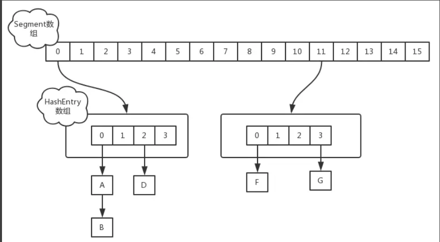
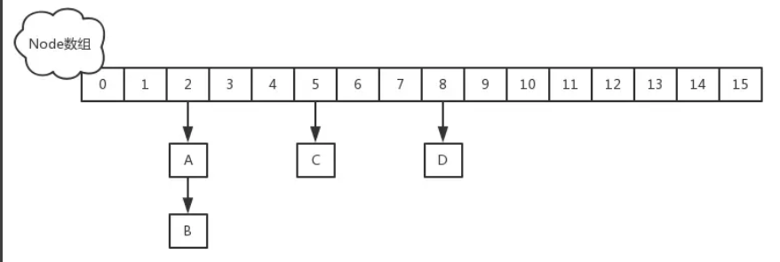

# 并发包中容器类	ConcurrentHashMap

ConcurrentHashMap，它是HashMap的并发版本，与HashMap相比，它有如下特点：
1. 并发安全
2. 直接支持一些原子复合操作
3. 支持高并发、读操作完全并行、写操作支持一定程度的并行
4. 与同步容器Collections.synchronizedMap相比，迭代不用加锁，不会抛出ConcurrentModificationException
5. 弱一致性

public class ConcurrentHashMap<K,V> extends AbstractMap<K,V> implements ConcurrentMap<K,V>, Serializable

JDK1.7 ConcurrentHashMap是为高并发设计的，具体实现比较复杂，主要有两点
1. 分段锁
2. 读不需要锁
#### 1.7


初始化时，计算出Segment数组的大小ssize和每个Segment中HashEntry数组的大小cap，并初始化Segment数组中第一个元素HashEntry数组的大小（之后Segment数组中之后的HashEntry数组大小都是以第一个数组为准的）；其中ssize大小为2的幂次方，默认为16，cap大小也是2的幂次方，最小值为2，最终结果根据根据初始化容量initialCapacity进行计算，计算过程如下：
```
static final int MIN_SEGMENT_TABLE_CAPACITY = 2;
if (c * ssize < initialCapacity)
            ++c;
        int cap = MIN_SEGMENT_TABLE_CAPACITY;
        while (cap < c)
            cap <<= 1;
```
`static final class Segment<K,V> extends ReentrantLock implements Serializable {...}`       
`static final class HashEntry<K,V> {}`

put实现       
当执行put方法插入数据时，根据key的hash值，在Segment数组中找到相应的位置，如果相应位置的Segment还未初始化，则通过CAS进行赋值，接着执行Segment对象的put方法通过加锁机制插入数据。      
实现如下：场景：线程A和线程B同时执行相同Segment对象的put方法
1. 线程A执行tryLock()方法成功获取锁，则把HashEntry对象插入到相应的位置；
2. 线程B获取锁失败，则执行scanAndLockForPut()方法，在scanAndLockForPut方法中，会通过重复执行tryLock()方法尝试获取锁，在多处理器环境下，重复次数为64，单处理器重复次数为1，当执行tryLock()方法的次数超过上限时，则执行lock()方法挂起线程B；
3. 当线程A执行完插入操作时，会通过unlock()方法释放锁，接着唤醒线程B继续执行；

同步容器使用synchronized，所有方法，竞争同一个锁，而ConcurrentHashMap采用分段锁技术，
将数据分为多个段，而每个段有一个独立的锁，每一个段相当于一个独立的哈希表，分段的依据也是哈希值，
无论是保存键值对还是根据键查找，都先根据键的哈希值映射到段，再在段对应的哈希表上进行操作。

采用分段锁，可以大大提高并发度，多个段之间可以并行读写。
默认情况下，段是16个，不过，这个数字可以通过构造方法进行设置，如下所示：
public ConcurrentHashMap(int initialCapacity, float loadFactor, int concurrencyLevel)
concurrencyLevel表示估计的并行更新的线程个数，ConcurrentHashMap会将该数转换为2的整数次幂，比如14转换为16，25转换为32。

在对每个段的数据进行读写时，ConcurrentHashMap也不是简单的使用锁进行同步，内部使用了CAS、对一些写采用原子方式，
实现比较复杂，实现的效果是，对于写操作，需要获取锁，不能并行，但是读操作可以，多个读可以并行，
写的同时也可以读，这使得ConcurrentHashMap的并行度远远大于同步容器。

使用同步容器，在迭代中需要加锁，否则可能会抛出ConcurrentModificationException。
ConcurrentHashMap没有这个问题，在迭代器创建后，在迭代过程中，如果另一个线程对容器进行了修改，迭代会继续，不会抛出异常。

ConcurrentHashMap的迭代器创建后，就会按照哈希表结构遍历每个元素，但在遍历过程中，内部元素可能会发生变化，
如果变化发生在已遍历过的部分，迭代器就不会反映出来，而如果变化发生在未遍历过的部分，迭代器就会发现并反映出来，这就是弱一致性。
参考ConcurrentHashMapIteratorDemo

类似的情况还会出现在ConcurrentHashMap的另一个方法：

//批量添加m中的键值对到当前Map
public void putAll(Map<? extends K, ? extends V> m)
该方法并非原子操作，而是调用put方法逐个元素进行添加的，在该方法没有结束的时候，部分修改效果就会体现出来。

#### 1.8



1.8中放弃了Segment臃肿的设计，取而代之的是采用Node + CAS + Synchronized来保证并发安全进行实现

只有在执行第一次put方法时才会调用initTable()初始化Node数组。而1.7中是在初始化的时候初始化的各个数组。

put方法实现       
当执行put方法插入数据时，根据key的hash值，在Node数组中找到相应的位置，实现如下
>1. 如果相应位置的Node还未初始化，则通过CAS插入相应的数据；
>2. 如果相应位置的Node不为空，且当前该节点不处于移动状态，则对该节点加synchronized锁，如果该节点的hash不小于0，则遍历链表更新节点或插入新节点；
>3. 如果该节点是TreeBin类型的节点，说明是红黑树结构，则通过putTreeVal方法往红黑树中插入节点；
>4. 如果binCount不为0，说明put操作对数据产生了影响，如果当前链表的个数达到8个，则通过treeifyBin方法转化为红黑树，如果oldVal不为空，说明是一次更新操作，没有对元素个数产生影响，则直接返回旧值；
>5. 如果插入的是一个新节点，则执行addCount()方法尝试更新元素个数baseCount

get方法实现         
ConcurrentHashMap的get操作还是挺简单的，无非就是通过hash来找key相同的节点而已，当然需要区分链表和树形两种情况。    
1. 计算hash值
2. 判断table是否为空，如果为空，直接返回null
3. 根据hash值获取table中的Node节点（tabAt(tab, (n – 1) & h)），然后根据链表或者树形方式找到相对应的节点，返回其value值。

ConcurrentHashMap，它是并发版的HashMap，通过分段锁和其他技术实现了高并发，支持原子条件更新操作，不会抛出ConcurrentModificationException，实现了弱一致性。

Java中没有并发版的HashSet，但可以通过Collections.newSetFromMap方法基于ConcurrentHashMap构建一个。

我们知道HashMap/HashSet基于哈希，不能对元素排序，对应的可排序的容器类是TreeMap/TreeSet，
并发包中可排序的对应版本不是基于树，而是基于Skip List（跳跃表）的，类分别是ConcurrentSkipListMap和ConcurrentSkipListSet

HashMap是一个线程非安全的容器，在多线程环境下，put操作是有可能产生死循环，导致CPU利用率接近100%。为了解决该问题，提供了Hashtable和Collections.synchronizedMap(Map<K,V> m)两种解决方案，但是这两种方案都是对读写加同步锁，吞吐量较低，性能较为低下。故而Doug Lea大神给我们提供了高性能的线程安全HashMap：ConcurrentHashMap。

在1.8版本以前，ConcurrentHashMap采用分段锁的概念，使锁更加细化，但是1.8已经改变了这种思路，而是利用CAS+Synchronized来保证并发更新的安全，当然底层采用数组+链表+红黑树的存储结构。

HashMap的核心数据结构就是链表。在ConcurrentHashMap中就不一样了，如果链表的数据过长是会转换为红黑树来处理。但它并不是直接转换，而是将这些链表的节点包装成TreeNode放在TreeBin对象中，然后由TreeBin完成红黑树的转换。

TreeBin 该类并不负责key-value的键值对包装，它用于在链表转换为红黑树时包装TreeNode节点，也就是说ConcurrentHashMap红黑树存放是TreeBin，不是TreeNode。构造方法就是将TreeNode构造成红黑树的过程

#### 总结
1. 1.7中Segment通过继承了ReentrantLock显式锁实现了分段锁，put操作时会锁住所在的段
2. 1.8中通过CAS和synchronized，put时如果是新增元素则通过CAS直接新增，如果是更新操作，则会对该节点加同步锁。
3. 并发状态下各个容器的size方法的返回值是一个不精确的值，因为在进行统计的时候有其他线程正在进行插入和删除操作。