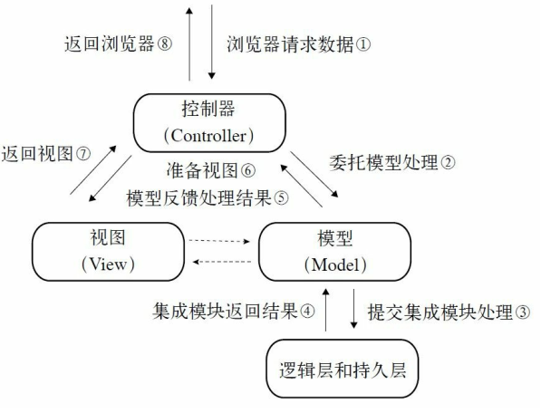

# 模型视图控制器模型 MVC Model-View-Controller

MVC框架的目的是通过控制器C将模型M（代表的是业务数据和业务逻辑）和视图V（人机交互的界面）实现代码分离，从而使同一个逻辑共享相同、不同的视图。

#### MVC框架的版本
1. Model1 它的视图中存在大量的流程控制和代码开发，也就是控制器和视图还具有部分的耦合。        
   > 早期的开发模式中，jsp中融合了控制器和视图的功能，如jstl的core lib/Spring Security中的sec lib等标签库，都可以实现控制器的一些功能。
2. Model2 提倡视图和模型的完全分离，视图仅仅负责展示服务，不再参与业务的行为和数据处理。

MVC框架的逻辑流程图：
    