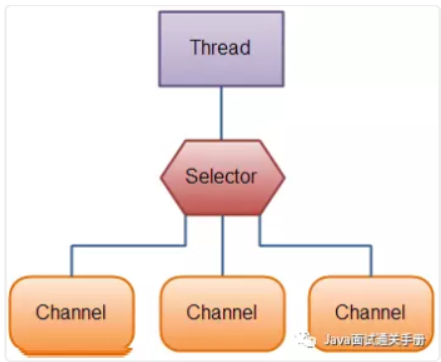

# NIO New 

NIO是一种同步非阻塞的I/O模型，在Java 1.4 中引入了NIO框架，对应 java.nio 包，提供了 Channel , Selector，Buffer等抽象。

NIO中的N可以理解为Non-blocking，不单纯是New。它支持面向缓冲的，基于通道的I/O操作方法。 NIO提供了与传统BIO模型中的 Socket 和 ServerSocket 相对应的 SocketChannel 和 ServerSocketChannel 两种不同的套接字通道实现,两种通道都支持阻塞和非阻塞两种模式。阻塞模式使用就像传统中的支持一样，比较简单，但是性能和可靠性都不好；非阻塞模式正好与之相反。对于低负载、低并发的应用程序，可以使用同步阻塞I/O来提升开发速率和更好的维护性；对于高负载、高并发的（网络）应用，应使用 NIO 的非阻塞模式来开发。

NIO的特性/NIO与IO区别

1)Non-blocking IO（非阻塞IO）
IO流是阻塞的，NIO流是不阻塞的。

Java NIO使我们可以进行非阻塞IO操作。比如说，单线程中从通道读取数据到buffer，同时可以继续做别的事情，当数据读取到buffer中后，线程再继续处理数据。写数据也是一样的。另外，非阻塞写也是如此。一个线程请求写入一些数据到某通道，但不需要等待它完全写入，这个线程同时可以去做别的事情。

Java IO的各种流是阻塞的。这意味着，当一个线程调用 read() 或 write() 时，该线程被阻塞，直到有一些数据被读取，或数据完全写入。该线程在此期间不能再干任何事情了

2)Buffer(缓冲区)
IO 面向流(Stream oriented)，而 NIO 面向缓冲区(Buffer oriented)。

Buffer是一个对象，它包含一些要写入或者要读出的数据。在NIO类库中加入Buffer对象，体现了新库与原I/O的一个重要区别。在面向流的I/O中·可以将数据直接写入或者将数据直接读到 Stream 对象中。虽然 Stream 中也有 Buffer 开头的扩展类，但只是流的包装类，还是从流读到缓冲区，而 NIO 却是直接读到 Buffer 中进行操作。

在NIO厍中，所有数据都是用缓冲区处理的。在读取数据时，它是直接读到缓冲区中的; 在写入数据时，写入到缓冲区中。任何时候访问NIO中的数据，都是通过缓冲区进行操作。

最常用的缓冲区是 ByteBuffer,一个 ByteBuffer 提供了一组功能用于操作 byte 数组。除了ByteBuffer,还有其他的一些缓冲区，事实上，每一种Java基本类型（除了Boolean类型）都对应有一种缓冲区。

3)Channel (通道)
NIO 通过Channel（通道） 进行读写。

通道是双向的，可读也可写，而流的读写是单向的。无论读写，通道只能和Buffer交互。因为 Buffer，通道可以异步地读写。

4)Selectors(选择器)
NIO有选择器，而IO没有。

选择器用于使用单个线程处理多个通道。因此，它需要较少的线程来处理这些通道。线程之间的切换对于操作系统来说是昂贵的。 因此，为了提高系统效率选择器是有用的。

为什么大家都不愿意用 JDK 原生 NIO 进行开发呢？从上面的代码中大家都可以看出来，是真的难用！除了编程复杂、编程模型难之外，它还有以下让人诟病的问题：

JDK 的 NIO 底层由 epoll 实现，该实现饱受诟病的空轮询 bug 会导致 cpu 飙升 100%项目庞大之后，自行实现的 NIO 很容易出现各类 bug，维护成本较高，Netty 的出现很大程度上改善了 JDK 原生 NIO 所存在的一些让人难以忍受的问题。

**Java原生的NIO过于繁琐，Netty封装了Java的NIO。Netty是一个异步事件驱动的网络应用框架，用于快速开发可维护的高性能服务器和客户端。**