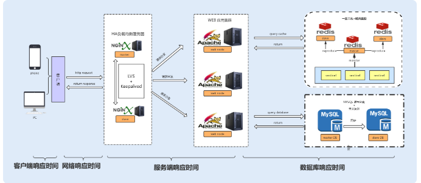

# 如何指定性能优化的标准？

在代码层面保证有效的编程
1. 减少磁盘IO操作
2. 降低竞争锁的使用
3. 使用高效的算法
4. 充分利用设计模式来优化业务代码
>例如，设计商品价格的时候，往往会有很多折扣活动、红包活动，我们可以用装饰模式去设计这个业务

#### 系统的瓶颈来源
1. CPU （正则表达式引起的回溯）
> 占用CPU计算资源较多的操作，导致其他资源无法争夺到CPU而导致响应缓慢，从而带来系统性能问题
2. 内存
> 1. 系统堆内存的读写速度非常快，所以基本不存在读写性能瓶颈
> 2. 内存空间有限导致的内粗泄露、内存溢出问题
3. 磁盘I/O	
> 磁盘相比内存来说，存储空间要大很多，但磁盘 I/O 读写的速度要比内存慢，虽然目前引入的 SSD 固态硬盘已经有所优化，但仍然无法与内存的读写速度相提并论。
4. 网络
> 网络对于系统性能来说，也起着至关重要的作用。带宽过低的话，对于传输数据比较大，或者是并发量比较大的系统，网络就很容易成为性能瓶颈。
5. 异常
> Java 应用中，抛出异常需要构建异常栈，对异常进行捕获和处理，这个过程非常消耗系统性能。如果在高并发的情况下引发异常，持续地进行异常处理，那么系统的性能就会明显地受到影响。
6. 数据库
> 数据库的操作往往是涉及到磁盘 I/O 的读写。大量的数据库读写操作，会导致磁盘 I/O 性能瓶颈，进而导致数据库操作的延迟性。对于有大量数据库读写操作的系统来说，数据库的性能优化是整个系统的核心。
7. 锁竞争
> 在并发编程中，我们经常会需要多个线程，共享读写操作同一个资源，这个时候为了保持数据的原子性（即保证这个共享资源在一个线程写的时候，不被另一个线程修改），我们就会用到锁。锁的使用可能会带来上下文切换，从而给系统带来性能开销。JDK1.6 之后，Java 为了降低锁竞争带来的上下文切换，对 JVM 内部锁已经做了多次优化，例如，新增了偏向锁、自旋锁、轻量级锁、锁粗化、锁消除等。而如何合理地使用锁资源，优化锁资源，就需要你了解更多的操作系统知识、Java 多线程编程基础，积累项目经验，并结合实际场景去处理相关问题。

#### 衡量系统性能的指标
1. 响应时间         
        
> 1. 数据库响应时间：数据库操作所消耗的时间，往往是整个请求链中最耗时的
> 1. 服务端响应时间：服务端包括 Nginx 分发的请求所消耗的时间以及服务端程序执行所消耗的时间
> 1. 网络响应时间：这是网络传输时，网络硬件需要对传输的请求进行解析等操作所消耗的时间
> 1. 客户端响应时间：对于普通的 Web、App 客户端来说，消耗时间是可以忽略不计的，但如果你的客户端嵌入了大量的逻辑处理，消耗的时间就有可能变长，从而成为系统的瓶颈
2. 吞吐量
> 1. TPS Transaction Per Second 每秒事务处理量         
     **接口的TPS是重要的衡量系统性能的指标**      
     QPS Query Per Second 单位时间按内请求的数量       
     TPS 代表一个事务的处理，可以包含很多次请求
> 2. IOPS Input/Output Per Second 每秒的输入输出量，即读写次数。单位时间内系统能处理的I/O请求次数
> 3. 数据吞吐量 单位时间内可以成功传输的数据量。对于大量顺序读写频繁的应用，传输大量连续数据，例如，电视台的视频编辑、视频点播 VOD（Video On Demand），数据吞吐量则是关键衡量指标
> 4. 网络吞吐量 这个是指网络传输时没有帧丢失的情况下，设备能够接受的最大数据速率。网络吞吐量不仅仅跟带宽有关系，还跟 CPU 的处理能力、网卡、防火墙、外部接口以及 I/O 等紧密关联。而吞吐量的大小主要由网卡的处理能力、内部程序算法以及带宽大小决定
3. 计算机资源分配使用率
> 通常由 CPU 占用率、内存使用率、磁盘 I/O、网络 I/O 来表示资源使用率。这几个参数好比一个木桶，如果其中任何一块木板出现短板，任何一项分配不合理，对整个系统性能的影响都是毁灭性的。
4. 负载承受压力
> 当系统压力上升时，你可以观察，系统响应时间的上升曲线是否平缓。这项指标能直观地反馈给你，系统所能承受的负载压力极限。例如，当你对系统进行压测时，系统的响应时间会随着系统并发数的增加而延长，直到系统无法处理这么多请求，抛出大量错误时，就到了极限。

