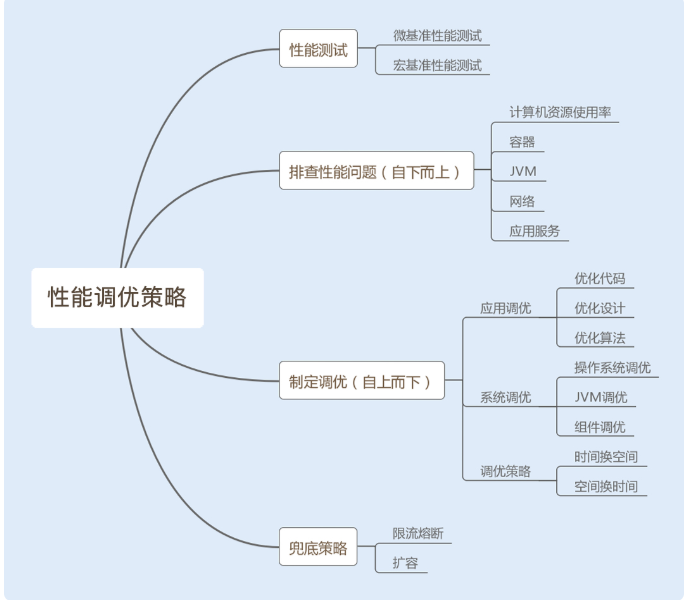

# 如何制定性能调优策略？

#### 测试方法
1. 微基准测试方式
> 微基准性能测试可以精准定位到某个模块或者某个方法的性能问题，特别适合做一个功能模块或者一个方法在不同实现方式下的性能对比。例如，对比一个方法使用同步实现和非同步实现的性能。
2. 宏基准测试方式
> 宏基准性能测试是一个综合测试，需要考虑到测试环境、测试场景和测试目标。
#### 热身问题
1. 在  Java  编程语言和环境中，.java  文件编译成为  .class  文件后，机器还是无法直接运行  .class  文件中的字节码，需要通过解释器将字节码转换成本地机器码才能运行。为了节约内存和执行效率，代码最初被执行时，解释器会率先解释执行这段代码。
2. 随着代码被执行的次数增多，当虚拟机发现某个方法或代码块运行得特别频繁时，就会把这些代码认定为热点代码（Hot Spot Code）。为了提高热点代码的执行效率，在运行时，虚拟机将会通过即时编译器（JIT compiler，just-in-time compiler）把这些代码编译成与本地平台相关的机器码，并进行各层次的优化，然后存储在内存中，之后每次运行代码时，直接从内存中获取即可。
#### 性能测试结果不稳定
因为有多不确定因素，比如其他进程的影响、网络波动、每个阶段GC回收的不同等。我们可以通过多次测试，将测试结果求平均，或者统计一个曲线图，只要保证我们的平均值是在合理范围之内，而且波动不是很大，这种情况下，性能测试就是通过的。
#### 多JVM情况下的影响
如果我们的服务器有多个  Java  应用服务，部署在不同的 Tomcat  下，这就意味着我们的服务器会有多个  JVM。任意一个  JVM 都拥有整个系统的资源使用权。如果一台机器上只部署单独的一个  JVM，在做性能测试时，测试结果很好，或者你调优的效果很好，但在一台机器多个  JVM  的情况下就不一定了。所以我们应该尽量避免线上环境中一台机器部署多个  JVM  的情况。
#### 合理分析结果，制定调优策略
通过自下而上的方式分析查找问题。首先从操作系统层面，查看系统的  CPU、内存、I/O、网络的使用率是否存在异常，再通过命令查找异常日志，最后通过分析日志，找到导致瓶颈的原因；还可以从  Java  应用的  JVM  层面，查看  JVM  的垃圾回收频率以及内存分配情况是否存在异常，分析日志，找到导致瓶颈的原因。

如果系统和  JVM  层面都没有出现异常情况，我们可以查看应用服务业务层是否存在性能瓶颈，例如  Java  编程的问题、读写数据瓶颈等等。

1. 优化代码
2. 优化设计
3. 优化算法
4. 时间换空间
5. 空间换时间
6. 参数调优

#### 兜底策略，确保系统稳定性
1. 限流，对系统的入口设置最大访问限制。这里可以参考性能测试中探底接口的 TPS 。同时采取熔断措施，友好地返回没有成功的请求。
2. 实现智能化横向扩容。智能化横向扩容可以保证当访问量超过某一个阈值时，系统可以根据需求自动横向新增服务。
3. 提前扩容。这种方法通常应用于高并发系统，例如，瞬时抢购业务系统。这是因为横向扩容无法满足大量发生在瞬间的请求，即使成功了，抢购也结束了。

目前很多公司使用 Docker  容器来部署应用服务。这是因为 Docker  容器是使用 Kubernetes  作为容器管理系统，而 Kubernetes  可以实现智能化横向扩容和提前扩容 Docker  服务。

 