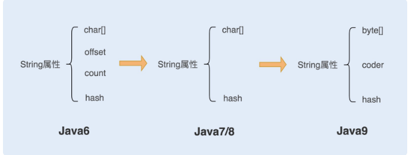
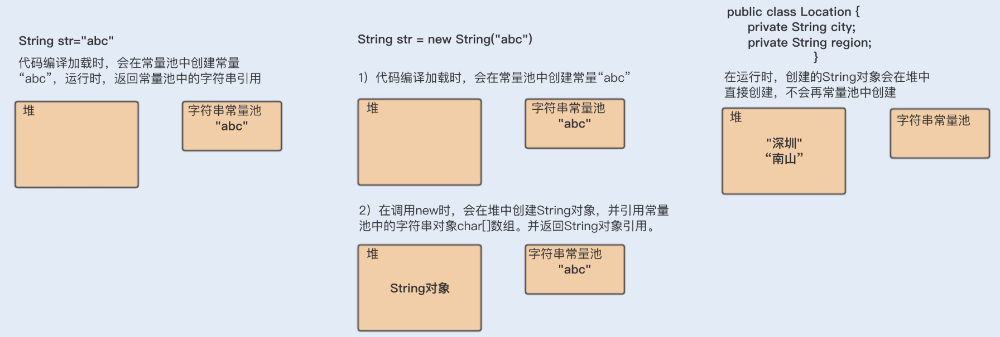

# Java 编程性能优化 字符串 String 



1.9 新属性 coder 的作用是计算字符串长度或者使用 indexOf（）函数时，我们需要根据这个字段，判断如何计算字符串长度。coder 属性默认有 0 和 1 两个值，0 代表 Latin-1（单字节编码），1 代表 UTF-16。如果 String 判断字符串只包含了 Latin-1，则 coder 属性值为 0，反之则为 1。

String 中 char 数组被 final 修饰  String对象的不可变性 CopyOnWrite 机制的体现

#### 不可以变性的好处
1. 保证了String对象的安全性
2. 保证 hash 属性值不会频繁变更，确保了唯一性，使得类似 HashMap 容器才能实现相应的 key-value 缓存功能。
3. 可以实现字符串常量池。
    > 在 Java 中，通常有两种创建字符串对象的方式，一种是通过字符串常量的方式创建，如 String str=“abc”；另一种是字符串变量通过 new 形式的创建，如 String str = new String(“abc”)。
    > 1. 当代码中使用第一种方式创建字符串对象时，JVM 首先会检查该对象是否在字符串常量池中，如果在，就返回该对象引用，否则新的字符串将在常量池中被创建。这种方式可以减少同一个值的字符串对象的重复创建，节约内存。
    > 2. String str = new String(“abc”) 这种方式，首先在编译类文件时，"abc"常量字符串将会放入到常量结构中，在类加载时，“abc"将会在常量池中创建；其次，在调用 new 时，JVM 命令将会调用 String 的构造函数，同时引用常量池中的"abc” 字符串，在堆内存中创建一个 String 对象；最后，str 将引用 String 对象。

#### 对象和对象引用
对象在内存中是一块内存地址，变量中存储的是对象的引用地址，而不是对象本身。

在使用 + 对字符串进行拼接时，会被jvm优化成StringBuilder的方式。
```
String str = "abcdef"; 
for(int i=0; i<1000; i++) { 
    str = str + i; 
}
```
jvm优化好之后的实现：
```
String str = "abcdef";
for(int i=0; i<1000; i++) {
 str = (new StringBuilder(String.valueOf(str))).append(i).toString();
}
```

1. 在字符串常量中，默认会将对象放入常量池；在字符串变量中，对象是会创建在堆内存中，同时也会在常量池中创建一个字符串对象，引用赋值到堆内存对象中，并返回堆内存对象引用。
2. **如果调用 intern 方法，会去查看字符串常量池中是否有等于该对象的字符串，如果没有，就在常量池中新增该对象，并返回该对象引用；如果有，就返回常量池中的字符串引用。堆内存中原有的对象由于没有引用指向它，将会通过垃圾回收器回收。**



对于class文件中的字符串常量像 1 和 2 中的情况会在类编译加载到jvm时被放进常量池中去，这种只是针对类文件中的字符串常量，对于 3 中在运行时产生的字符串对象是在堆内存中创建的的，不会在常量池中创建，只有调用String的intern方法时才会将堆内存中的字符串放入常量池中，例如运行时动态生成的字符串和从数据库中获取的字符串都是位于堆内存中。

使用 intern 方法需要注意的一点是，一定要结合实际场景。因为常量池的实现是类似于一个 HashTable 的实现方式，HashTable 存储的数据越大，遍历的时间复杂度就会增加。如果数据过大，会增加整个字符串常量池的负担。

#### 总结
1. StringBuffer是线程安全的，涉及到锁竞争，性能低
2. StringBuilder是线程不安全的，性能高
3. String使用了CopyOnWrite机制，线程安全，内部的char数组被final修饰，不可变的原因
4. 分清字符串常量和运行时产生的字符串对象的创建的内存位置

