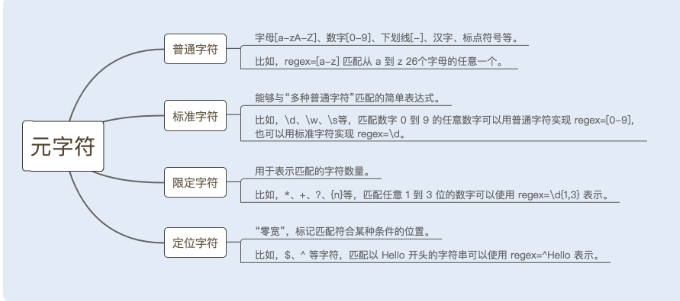

# 慎重使用正则表达式

**排除法能很好地区分是框架性能问题还是业务代码性能问题**

正则表达式使用不当会引起回溯陷阱（Catastrophic Backtracking）。

构造正则表达式语法的元字符，由普通字符、标准字符、限定字符（量词）、定位字符（边界字符）组成。详情可见下图：


目前实现正则表达式引擎的方式有两种：
1. DFA 自动机（Deterministic Final Automata 确定有限状态自动机）
2. NFA 自动机（Non deterministic Finite Automaton 非确定有限状态自动机）。
> 1. 对比来看，构造 DFA 自动机的代价远大于 NFA 自动机，但 DFA 自动机的执行效率高于 NFA 自动机。
> 2. 假设一个字符串的长度是 n，如果用 DFA 自动机作为正则表达式引擎，则匹配的时间复杂度为 O(n)；如果用 NFA 自动机作为正则表达式引擎，由于 NFA 自动机在匹配过程中存在大量的分支和回溯，假设 NFA 的状态数为 s，则该匹配算法的时间复杂度为 O（ns）。
> 3. NFA 自动机的优势是支持更多功能。例如，捕获 group、环视、占有优先量词等高级功能。这些功能都是基于子表达式独立进行匹配，因此在编程语言里，使用的正则表达式库都是基于 NFA 实现的。
> 4. 状态数就是不同的匹配格式，例如 ab{1,2}c，则状态数为2, 即 abc abbc。

```
str = "abbc";
reg = "ab{1,3}c" 
```
> 回溯的过程：reg 中的 b 匹配到 str 中的第一个 b 时，由于 b 可以匹配 1 到 3 个 b，所以还会继续用 reg 中的 b 继续匹配 str 中的下一个字符， 然后能匹配到，再匹配第三个字符发现是 c,发现不匹配，此时就会发生回溯，已经读取的第四个字符串 c 将被吐出去，指针回到第三个字符 b 的位置。回溯之后，结束 b{1,3} 的匹配，继续匹配 reg 中的下一个匹配符 c，和字符串中的第四个字符 c 进行比较，结果匹配，结束。

#### 如何避免回溯

1. 贪婪模式（Greedy）顾名思义，就是在数量匹配中，如果单独使用 +、 ? 、* 或{min,max} 等量词，正则表达式会匹配尽可能多的内容。
> 上面的例子就是在贪婪模式下，NFA 自动机读取了最大的匹配范围，即匹配 3 个 b 字符。匹配发生了一次失败，就引起了一次回溯。如果匹配结果是“abbbc”，就会匹配成功。
2. 懒惰模式（Reluctant）在该模式下，正则表达式会尽可能少地重复匹配字符。如果匹配成功，它会继续匹配剩余的字符串。
> 1. str = "abc";
> 2. reg = "ab{1,3}?c" 
> 3. 匹配结果是“abc”，该模式下 NFA 自动机首先选择最小的匹配范围，即匹配 1 个 b 字符，因此就避免了回溯问题。
3. 独占模式（possessive）同贪婪模式一样，独占模式一样会最大限度地匹配更多内容；不同的是，在独占模式下，匹配失败就会结束匹配，不会发生回溯问题。
> 1. str = "abbc";
> 2. reg = "ab{1,3}+bc"  
> 3. 结果是不匹配，结束匹配，不会发生回溯问题。

避免回溯的方法就是：使用懒惰模式和独占模式。

#### 正则表达式的优化
1. 少用贪婪，多用独占模式
2. 减少分支选择
3. 减少捕获嵌套

#### 总结
1. 慎重使用正则表达式


